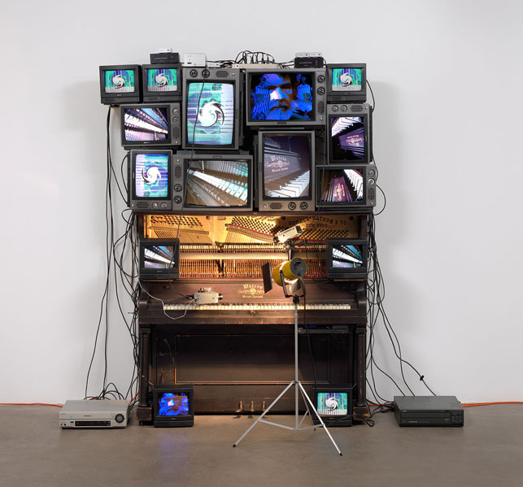

<section id="about" class="section scrollspy" markdown="1">

Matters in Media Art is an information resource on the care of media art.

Nam June Paik _Untitled_ (1993). Player piano, 15 televisions, two cameras, two laser disc players, one electric light and light bulb, and wires, overall approx. 8′ 4″ x 8′ 9″ x 48″ (254 x 266.7 x 121.9 cm), including laser disc player and lamp. The Museum of Modern Art, New York. Bernhill Fund, Gerald S. Elliot Fund, gift of Margot Paul Ernst, and purchase. © 2013 Estate of Nam June Paik

</section>

<section id="project-history" class="section scrollspy" markdown="1">

## Project History

Launched in 2005, this collaborative project between the New Art Trust (NAT) and its partner museums – the Museum of Modern Art (MoMA), the San Francisco Museum of Modern Art (SFMOMA) and Tate – has been designed to help those who collect and keep media artworks (e.g. video, film, audio and software-based installations).

Conceived originally as a consensus building project for the three partner museums of the NAT, the enduring goal has been to affirm our commitment to media art and artists by developing shared practices for the works’ care and preservation. It has always been the consortium’s hope that if the three museums could come together to agree on emerging stewardship practices, then by sharing these practices online they would be used, improved upon and refined by larger audiences of artists and collectors.
</section>

<section id="contribution-guidelines" class="section scrollspy" markdown="1">

## Contribution Guidelines

_While we refine the site, we welcome any and all feedback you may have. Please take a moment to fill out our <a href="http://goo.gl/forms/kfPsM8tcic">survey</a> to help us further improve the website._

The Matters in Media Art website follows the essential tenets of the [open source philosophy](https://opensource.org/osd). All of the website's source code and content are openly accessible in a repository hosted on GitHub, which offers a framework for anyone to suggest, discuss, and contribute edits to mattersinmediaart.org's content and/or design and functionality.

Fundamental to this open source approach is the licensing that we have chosen to adopt. All mattersinmediaart.org source code is licensed under the [MIT license](https://en.wikipedia.org/wiki/MIT_License), and all intellectual content (unless otherwise noted) is licensed under the Creative Commons [Attribution 4.0 International](http://creativecommons.org/licenses/by/4.0/) license. While these two licenses are quite different from each other, generally speaking, this means that all mattersinmediaart.org content and source code is free to copy, share, adopt, reuse, and redistribute.

### Contributing

We welcome input, feedback, and contributions to mattersinmediaart.org from anyone with a passionate interest in the topic. Contributing to mattersinmediaart.org does not necessarily require any specific level of technical expertise, as there are two different ways of contributing, one of which is incredibly easy!

The first and easiest way of contributing is to do what is called "filing an issue" [on our GitHub page](https://github.com/matters-in-media-art/mattersinmediart.org/issues). GitHub issues can be used to talk about errors or problems with content or functionality, and gives us a place to have a dialog about the problem. [Here is a guide on how to file issues on GitHub](https://help.github.com/articles/creating-an-issue/).

The second way of contributing to mattersinmediaart.org is to actually edit the website's content or source code, and then submit this edit for consideration through what GitHub calls a "pull request". [Here is a guide on how to submit pull requests](https://help.github.com/articles/using-pull-requests/).

<!--

make a note about how we are accepting pull requests, but not new repo admins at the moment

also some text about how we are a small team of volunteers and time is limited

link to the contributors page and explain the distinction between project team and contributors

-->

</section>

<section id="the-team" class="section scrollspy" markdown="1">

## Project team
* Amy Brost, Andrew W. Mellon Fellow in Media Conservation, MoMA
* Jim Coddington, Agnes Gund Chief Conservator, MoMA
* Patricia Falcao, Time-based Media Conservator, Tate
* Ben Fino-Radin, Associate Media Conservator, MoMA
* Martina Haidvogl, Associate Media Conservator, SFMOMA
* Mark Hellar, Consultant, Hellar Studios LLC
* Anna Henry, Digital Preservation Manager, Tate
* Pip Laurenson, Head of Collection Care Research, Tate
* Kate Lewis, Media Conservator, MoMA
* Peter Oleksik, Assistant Media Conservator, MoMA
* Claudia Roeck, Assistant Media Conservator, Tate
* Jill Sterrett, Director of Collections and Conservation, SFMOMA

### Past

* John Alexander, Senior Assistant Registrar, MoMA
* Nancy Adelson, Deputy General Counsel, MoMA
* Ramona Bannayan, Senior Deputy Director, Exhibitions and Collections, MoMA
* Michelle Barger, Deputy Head of Conservation/Conservator of Objects, SFMOMA
* Bryony Bery, Sculpture Conservation Researcher/Administrator, Tate
* Sydney Briggs, Associate Registrar, Collections, MoMA
* Catherine Clement, Senior Loans Registrar, Tate
* Allison Cummings, Assistant Registrar for Permanent Collection, SFMOMA
* Stuart Comer, Chief Curator of Media and Performance Art, MoMA
* Corey D’Augustine, Conservation Fellow, MoMA
* Katie Dance, E-Collection Curator, Tate
* Margo Delidow, Conservation Fellow, MoMA
* Sophie Dijan, Conservation Administration, Tate
* Steve Dye, Exhibitions Technical Manager, SFMOMA
* Christopher Eamon, Director, New Art Trust on Matters in Media Art, SFMOMA
* Adrian George, Curator, Tate
* Lisa Hayes, Loans Registrar, Tate
* David Hollely, Production Manager, Exhibition Design & Production, MoMA
* Charlie Kalinowski, Media Services Manager, AV, MoMA
* Wynne Kettell, Registrar Intern, MoMA
* Barbara London, Associate Curator, Media, MoMA
* K Mita, Director, Audio Visual & e-Commerce Technology, MoMA
* Anne Morra, Assistant Curator, Department of Film and Media, MoMA
* Sarah Joyce, Senior Conservator for Time-Based Media, Tate
* Alice Keys-Toyer, Art Handling Administrator, Tate
* Jon Lewis, Senior Conservation Technician for Time-Based Media, Tate
* Gregor Muir, Kramlich Curator of Contemporary Art, Tate
* Alex Musson, Web Developer, Tate
* Anna Nesbit, AV Manager Art Handling, Tate
* Kate Parsons, Head Registrar, Tate
* Marie-Chantale Poisson, Fellow in the Conservation of Contemporary Art, SFMOMA
* Gwynne Barney Ryan, Fellow in the Conservation of Contemporary Art, SFMOMA
* Kellie Schneider, Conservation Administrator, Tate
* Cara Starke, Curatorial Assistant, Media, MoMA
* Sarah Tinsley, Senior Digital Content Manager, Tate
* Glenn Wharton, Clinical Associate Professor of Museum Studies, NYU
* Allyson Wolfe, Registrar Assistant, MoMA
* Tanya Zimbardo, Assistant Curator in Media Arts, SFMOMA

#### Facilitator
George Gawlinski

In addition to the above participants this project called on the time and expertise of numerous colleagues around the world and within the participating institutions. Finally we would like to thank Pam and Dick Kramlich and the Directors of the New Art Trust, whose commitment to media art made this project possible.

</section>
