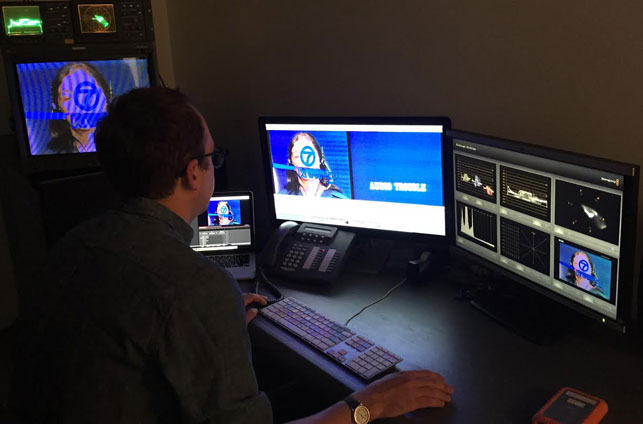

Media artworks require more complex documentation and cataloguing than traditional works of art. Some collecting institutions create separate databases for the additional metadata associated with these works. Decisions about what information to catalogue and how to catalogue it must be made carefully, following discussion among registration, curatorial, collections management, and conservation staff, and information systems staff. Read more here on [collection management systems]({{ site.url }}/sustaining-your-collection.html#Review-Collection-Management-Systems).

<h2 class="title"></h2>
<h2>Catalogue artwork</h2>
Enter detailed information about the artwork gathered during the acquisition process into collections database, minimally including:

* Artist, title, creation date, display dimensions, edition number
* Media format, duration
* Display equipment, sculptural components
* Provenance, exhibition history
* Accession/collection number
* Valuation, vendor cost
* Credit line

Additional information collected in the object file may be uploaded into the database or simply tracked and kept as hard copy.

<h2 class="title"></h2>
<h2>Inventory and label artwork components</h2>
* Media: e.g. video, audio, film, slides, hard-disk drives.
* Useful websites: [EAI Online Resource Guide](http://www.eai.org/resourceguide/formats.html); [Texas Commission Videotape Identification and Assessment Guide](http://www.arts.state.tx.us/video/); [IMAP Cataloguing Project](http://www.imappreserve.org/cat_proj/)
* Dedicated display equipment: (e.g. screens, monitors, projectors, speakers, playback equipment, lights, cameras). Record manufacturer and model numbers; collect product manuals for all equipment
* Useful website: [Mona Jimenez: Artist Instrumentation Database](http://www.fondation-langlois.org/html/e/page.php?NumPage=708)
* Sculptural components: measure and record all objects to be installed.

<h2 class="title"></h2>
<h2>Organize collected information</h2>
Create object files, or binder, from the acquisition process

These files will grow as the work is exhibited, loaned, and conserved. Most institutions create separate files for different purposes such as acquisition, curatorial, conservation and registration. Most of this information will be stored electronically as well, in collections databases, text documents, and digital images.

 <!-- end of slider -->

<section id="cataloging" class="section scrollspy" markdown="1">
## Cataloging Media Art
Records for media installations hold a great deal of information which can be difficult to manage.
Below is a guide to the type of material you might find in a record for a media artwork and a suggested way of organizing this information into sections within your file or binder.

<ul class="collapsible" data-collapsible="accordion">
<li>
  
Artwork

  

 * Accession Number
 * Artist
 * Title
 * Medium
 * Description
 * Dimensions
 * Duration
 * Image size (max / min)
 * Room size

</li>
<li>
  
Acquisition and registration

  

 * Incoming receipt
* Bill of sale
* Purchase agreement / Deed of gift
* In some cases you might have a commissioning agreement or a co-ownership agreement note to introduction to legal documents
* Curatorial proposal
* Copy of the Certificate of authenticity or the original
* Copyright agreement
* Acquisition correspondence
* Original inventory of media/ display equipment/ sculptural components which are part of the acquisition
* Cost assessment
* Acquisition assessment

</li>

<li>
  
Dedicated component information

  

* Media
* Diagram or list of media components which shows the format, when it was made, what it was made from and what it is used for.
* Display equipment
* List of dedicated equipment which came as part of the purchase (say why it is dedicated)
* Manuals
* Sculptural components

</li>

<li>
  
Display specifications

  

* Installation specifications
* Additional floor plans and wiring diagrams etc.

</li>

<li>
  
Display history

  

 * List of prior displays
 * Information about displays and other editions of the work
 * Photographs relating to prior displays
 * Texts relating to prior displays
 * Display summary, including equipment used, logs of minor incidents reported during display, display maintenance procedures, budgets, installation plans, notes about exhibition formats made for the display, photographs, correspondence.
 * Loan documents  

</li>

<li>
  
Artist information

  

 * Artist and gallery contact sheet
 * Correspondence with the artist
 * Artist recommended technical specifications
 * Artist’s statement
* Artist’s interview

</li>

<li>
  
Art historical research / context

  

 * Documents relating to the artwork, including other editions
 * Exhibition reviews

</li>

<li>
  
Structure and condition assessments

  

* Structure and condition report(s)

</li>

<li>
  
Ongoing care

  

 * Media migration record
 * Template
 * Conservation treatment reports/ treatment photographs
 * Major damage reports
 * Storage guidelines
 * Disaster plan recommendations
* Scientific analysis reports
 * Guidelines for packing and transport

</li>
</ul>

<h2 class="title"></h2>
<h2>Document installed artwork</h2>
Review documentation from artist/vendor/donor. Is it sufficient for long-term care and future installation?

* Documenting media art includes recording the work in its existing state as it enters the collection:
* Photograph the installation and its individual components
* Videotape the initial installation
* Archive installation plans and specifications for display

<h2 class="title"></h2>
<h2>Conduct artist interviews</h2>
The artist interviews may actually include communications with the artist, technicians, owners, gallery staff and others familiar with the artwork. The goal of these interviews is to gather information about technical history, exhibition requirements, artist intent, and technological obsolescence.

(Guidelines for artist interviews may be found on the [INCCA website](http://www.incca.org/))

Create archival transcripts of the interviews. If they can be shared and may benefit colleagues, consider joining INCCA and entering abstracts of the interviews on the [INCCA Artists Archives Database](http://www.incca.org/)

<h2 class="title"></h2>
<h2>Develop conservation plan</h2>
The conservation plan anticipates:

* Installation equipment: maintenance requirements and future equipment replacement
* Media migration cycle
* Storage specifications
* Future conservation strategies and costs

Additional information about conserving media works may be found at the following websites:

* [EAI Online Resource Guide for Exhibiting, Collecting, and Preserving Media Art](http://www.eai.org/resourceguide/)
* [IMAP Preservation 101](http://www.imappreserve.org/pres_101/index.html)

<h2 class="title"></h2>
<h2>Prepare for future display</h2>
* Make media exhibition copies as needed
* Project costs for future exhibition

<h2 class="title"></h2>
<h2>Pack and store artwork</h2>
* Proper archival storage and packing is crucial to the longevity of the artwork.
* A brief summary of storage concerns for media may be found in [<a href="http://www.imappreserve.org/pres_101/index.html#storage">IMAP’s Preservation 101 section on Storage</a>).

 <!-- end of slider -->

</section>
<section id="post-templates" class="section scrollspy" markdown="1">

## Condition Report Templates

When assessing media art, aim to extend existing condition reporting practices to include media artworks. A condition report provides the baseline against which future examinations can be compared. For media-based works of art a report is divided into three sections – the media elements, the equipment and the overall installation. They are different from condition reports for more conventional works of art in that some of the components may be easily replaceable without loss. It is often not possible to know by looking at any component, its value or significance in relation to the identity of the work of art. In addition to the example reports below, please also refer to the website Time-based Media Conservation by Joanna Phillips, Time-based Media Conservator at the Solomon R. Guggenheim Museum http://www.guggenheim.org/conservation/time-based-media

 <!-- previous layout:
* [Structure and condition report]({{ site.url }}/downloads/structure_and_condition_reports.rtf) (RTF, 180KB)
* [Video artwork prompt sheet]({{ site.url }}/downloads/mattersmediaart_structureconditionreport_videoprompt.rtf) (RTF, 81KB)
* [Audio artwork prompt sheet]({{ site.url }}/downloads/mattersmediaart_structureconditionreport_audioprompt.rtf) (RTF, 77KB)
* [Film artwork prompt sheet]({{ site.url }}/downloads/mattersmediaart_structureconditionreport_filmprompt.rtf) (RTF, 103KB)
* [Slide artwork prompt sheet]({{ site.url }}/downloads/mattersmediaart_structureconditionreport_slideprompt.rtf) (RTF, 92KB)
* [Computer-based artwork prompt sheet]({{ site.url }}/downloads/mattersmediaart_structureconditionreport_computuerworksprompt.rtf) (RTF, 73KB)
* [Computer-based display equipment prompt sheet]({{ site.url }}/downloads/mattersmediaart_structureconditionreport_computerequipment.rtf) (RTF, 92KB)
* [Playback device display equipment prompt sheet]({{ site.url }}/downloads/mattersmediaart_structureconditionreport_playbackdevice.rtf) (RTF, 102KB)
* [Video projectors display equipment prompt sheet]({{ site.url }}/downloads/mattersmediaart_structureconditionreport_videoprojectors.rtf) (RTF, 125KB)
* [Screens and monitors display equipment prompt sheet]({{ site.url }}/downloads/mattersmediaart_structureconditionreport_screensmonitors.rtf) (RTF, 122KB)
* [Film projectors display equipment prompt sheet]({{ site.url }}/downloads/mattersmediaart_structureconditionreport_filmprojectors.rtf) (RTF, 114KB)
* [Slide projectors display equipment prompt sheet]({{ site.url }}/downloads/mattersmediaart_structureconditionreport_slideprojectors.rtf) (RTF, 114KB)
-->

<a href="{{ site.url }}/downloads/structure_and_condition_reports.rtf">
  
<i class="large material-icons">play_for_work</i>Structure and condition report
    

    </a>
    

 

<a href="{{ site.url }}/downloads/mattersmediaart_structureconditionreport_videoprompt.rtf">
  
<i class="large material-icons">play_for_work</i>Video artwork
    

    </a>
    

 

<a href="{{ site.url }}/downloads/mattersmediaart_structureconditionreport_audioprompt.rtf">
  
<i class="large material-icons">play_for_work</i>Audio artwork
    

    </a>
    

 

<a href="{{ site.url }}/downloads/mattersmediaart_structureconditionreport_filmprompt.rtf">
  
<i class="large material-icons">play_for_work</i>Film artwork
    

    </a>
    

 

<a href="{{ site.url }}/downloads/mattersmediaart_structureconditionreport_slideprompt.rtf">
  
<i class="large material-icons">play_for_work</i>Slide artwork
    

    </a>
    

 

<a href="{{ site.url }}/downloads/mattersmediaart_structureconditionreport_computuerworksprompt.rtf">
  
<i class="large material-icons">play_for_work</i>Computer-based artwork
    

    </a>
    

 

<a href="{{ site.url }}/downloads/mattersmediaart_structureconditionreport_computerequipment.rtf">
  
<i class="large material-icons">play_for_work</i>Computer-based display equipment
    

    </a>
    

 

<a href="{{ site.url }}/downloads/mattersmediaart_structureconditionreport_playbackdevice.rtf">
  
<i class="large material-icons">play_for_work</i>Playback device display equipment
    

    </a>
    

 

<a href="{{ site.url }}/downloads/mattersmediaart_structureconditionreport_videoprojectors.rtf">
  
<i class="large material-icons">play_for_work</i>Video projectors display equipment
    

    </a>
    

 

<a href="{{ site.url }}/downloads/mattersmediaart_structureconditionreport_screensmonitors.rtf">
  
<i class="large material-icons">play_for_work</i>Screens and monitors display equipment
    

    </a>
    

 

<a href="{{ site.url }}/downloads/mattersmediaart_structureconditionreport_filmprojectors.rtf">
  
<i class="large material-icons">play_for_work</i>Film projectors display equipment
    

    </a>
    

 

<a href="{{ site.url }}/downloads/mattersmediaart_structureconditionreport_slideprojectors.rtf">
  
<i class="large material-icons">play_for_work</i>Slide projectors display equipment
    

    </a>
    

 

<section id="guidelines" class="section scrollspy" markdown="1">

<section id="Assessment" class="section scrollspy" markdown="1">

</section>
<section id="assessing" class="section scrollspy" markdown="1">
## Assessing Digital Video

Assessing your digital video media is a crucial step on entering your collection. Not only will it help you to understand the technical characteristics and anomalies of the file(s), it will help you create a baseline against which future examinations can be compared, and generally gain a better understanding of each artwork and your collection as a whole.

Video files are assessed and condition checked both visually and aurally with the appropriate tools. This section covers the design requirements of a work station, approaches to running initial technical analysis on your file(s), the visual and aural technical assessment and its documentation.  

<ul class="collapsible" data-collapsible="accordion">
<li>
  
<i class="material-icons">visibility</i>Visual Assessment

  

  	

  		Color space and gamma, Luminance, and Chrominance are the key characteristics to visually asses
  	

    <strong> Tools for Visual Assessment</strong>
   <ul>
    <li>Reference monitor (SD vs HD)</li>
    <li>Waveform/ vectorscope</li>
   </ul>
  

</li>
<li>
  
<i class="material-icons">hearing</i>Aural Assessment 

  

Key characteristics for Aural assessment: Levels (db vs VU), Phase

   <ul>Tools for Aural Assessment
    <li>Meters (digital)</li>
    <li>Phase Oscilloscope</li>
    <li>Monitors</li>
    <li>Waveform visualization</li>
   </ul>
  

</li>
<li>
  
<i class="material-icons">warning</i>Visual and Aural Artifacts

  

   <ul>
    <li>Analogue ‘burn in’ artifacts</li>
    <li>Digital artifacts</li>
    <li>Identifying cause / original – A/V Artifact Atlas</li>
   </ul>
  

</li>
</ul>

</section>
<section id="workstation" class="section scrollspy" markdown="1">
###	 Assessment Workstation

To assess, quality-control and condition report your digital video files, you might want to consider designing a workstation that is customized to your needs and dedicated to these video evaluating activities. Below you will find three examples of workstations that serve various budgets and are aimed at different levels of quality-control. The three tiers outlined are designed to serve both standard definition (SD) and high definition (HD) video systems. If you are working exclusively with either SD or HD material, you could make savings by acquiring just the tools for your specific needs. The following aspects are the 7 key components relevant to all digital video assessment workstations.  

<ul class="collapsible" data-collapsible="accordion">
<li>
  
<i class="material-icons">settings_input_composite</i>Connection Types

  

  	

  		Since the signal connections of your devices will play an important role in the playback of your video files, these will be briefly described together with their commonly associated formats. It is important to note that many analog formats only support 1 signal type and therefore outputting them on a “better” (or more recent) signal type can actually change the authenticity of the signal. Keeping the signal native is has been referred to as transparent migration.
  	

  	

  		Composite Video [analog connection, SD]: All the information that composes the signal, luminance, chrominance, blanking and synchronization (CVBS), is merged together into one signal. Composite video is a single connection type (either BNC or RCA). Analog formats that utilize a composite signal output and are recorded using a composite signal include ½” open-reel, ¾” U-matic, laser disc and VHS.
  	

  	

  		S-Video or Y/C [analog connection, SD]: As opposed to the composite signal, S-Video separates the luminance (Y) and the chrominance (C) into two different channels. Thereby it is a step up in quality from the composite video. It is transmitted by a distinctive looking, 4-pin connector. Formats that allowed for Y/C include VHS and DVD.
  	

  	

  		Component Video [analog connection, SD]: Component video is the best quality connection to transmit analog video signals. The signal is separated into three channels: Y (luminance), Pb (Blue minus L) and Pr (Red minus L). The green is derived using the pythagorean theorem. Component video comes as three adjoined plugs, sometimes color-coded to green (Y), blue (Pb) and red (Pr). This connection should be used on analog Betacam and Betacam SP.
  	

  	

  		Serial Digital Interface [SDI, SD or HD]. The SDI signal is a digital bit stream that can be used to transmit analog and digital video signals, and has also been used to by digital formats to record the signal to tape (Digital Betacam). SD-SDI is a signal connection type, using the BNC connection type, that packages the video, aural, and any ancillary data (timecode, closed captioning, etc) into a signal bit stream for transmission. SD-SDI is a 4:2:2 YUV system of video transmission. HD-SDI uses the same principal but splits the signal amongst multiple connections to increase the bandwidth necessary for transmission of High Definition material.
  	

  	

  		High Definition Multimedia Interface [HDMI]: HDMI is typically used in the connection of monitors and other devices together in the transmission of high definition material.
  	

  

</li>
<li>
  
<i class="material-icons">settings_overscan</i>Monitor

  

  	

  		For standard definition video files –for example videos that come from SD tape transfers–, watching the video on a Cathode Ray Tube (CRT) monitor is crucial, as only these monitors will show you both fields of the interlaced content and provide you with an authentic display of the video signal. CRT monitors are no longer manufactured, however they can be found through appropriate web platforms (e.g. eBay) or forums who post when Broadcast studios sell off their equipment. Make sure the video inputs fit your system before you buy it, and calibration is recommended when setting up.
  	

  	

  	Viewing interlaced video files on a computer monitor is problematic because these monitors cannot display interlaced footage and will attempt to merge the fields together into discrete frames. Certain errors, e.g. a head clog from a tape digitization, can only affect one field and lead to a complete area of image loss, which you would not see on a computer monitor.

  	

  	With the advent of high definition video, the term progressive entered the video world. Progressive means that a video –just like film– contains full discrete frames, as opposed to the two-fields interlaced. Progressive video content is often indicated by a lower case p, for example 720p. These videos can be quality-controlled easily on a computer monitor. A more advanced approach for viewing these kinds of files would be a color-calibrated, LCD studio monitor.
    

  

</li>
<li>
  
<i class="material-icons">settings</i>Computer

  

  	
Watching digital videos, especially uncompressed, can be challenging for older or regular “desktop”-computers. Your workstation requires a relatively powerful computer, with a minimum of several GB of RAM. Most videos will lag, if you play them directly from external hard drives, depending on your interface, and from servers, depending on your connection; therefore it is good practice to save them locally for assessment requiring sufficient storage space on your computer. Alternatively you could consider an external hard drive or RAID with a fast interface connection. The platform you choose –Mac or PC– depends on the kind of software to be used: Final Cut Pro only works on Macs, whereas Adobe Premiere is available for both platforms. Make sure to choose your computer platform depending on your software and hardware needs and compatibilities.

  

</li>
<li>
  
<i class="material-icons">input</i>A/D converter

  

  	
An Analog to Digital converter is necessary to process both standard definition material from your computer to a CRT monitor as well as provides connection types for connecting external HD monitors and scopes.

  

</li>
<li>
  
<i class="material-icons">track_changes</i>Scopes

  

  	
Monitors, even when calibrated, are inherently subjective in how they represent the visual information. Oscilloscopes provide an objective view of the signal by providing access to the luminance and chrominance electronic information. The two critical scopes for the assessment of both analog and digital video are a waveform monitor and a vectorscope.

Waveform Monitor: [IMAGE]
The waveform monitor measures the luminance (black and white) information of the video signal. A graticule is used to plot the information on a scale and allows one to see whether the blacks are too low in the signal (which may disrupt sync in an analog system) or the whites are two high (which would allow visual confirmation that the whites are “blown out” or exceed 100 IRE).
Vectorscope: [IMAGE]The vectorscope is a 360 degree color wheel that measures the hue and saturation of the chrominance information in the video signal. Known references like fleshtone, blue sky, etc. can be used to discern whether the chrominance information is being represented faithfully.

  

</li>
<li>
  
<i class="material-icons">perm_device_information</i>Software

  

  	
Software is crucial in the assessment of your digital video material. It is important to understand the basics of the software and how it functions to know whether your video is being processed and faithfully represented. Typically, capture and editing software like Blackmagic’s Media Express, Adobe Premiere and Final Cut Pro X can be used to analyze the discrete portions of your video material and allows for an in-depth assessment of its basic characteristics (luminance, chrominance and audio). Free tools such as QCtools (REF) also allow for in-depth assessment of your video files and have been developed for the archiving community.

  

</li>
<li>
  
<i class="material-icons">volume_up</i>Audio

  

  	
[IMAGE OF MONITORS AND METERS]
Quality audio monitors and meters are also necessary in the assessment of video material. A pair of studio grade, near-field speakers is recommended for listening to a piece. In addition, audio scopes using either the decibel (dB) or volume unit (VU) method of measurement are useful in looking at whether the audio is clipped, compressed or otherwise distorted, and for measuring whether the audio is in phase or not. http://www.sweetwater.com/insync/phase-2/ 

  

</li>
</ul>

 

####	Cost Guide For Workstation Tools

<table class="assessment bordered highlight">
        <thead>
          <tr>
              <th data-field="id">Name of equipment</th>
              <th data-field="name">$</th>
              <th data-field="price">$$</th>
              <th data-field="price">$$$</th>
          </tr>
        </thead>

        <tbody>
          <tr>
            <td>Analog-to-digital video card</td>
            <td class="yes"></td>
            <td class="yes"></td>
            <td class="yes"></td>
          </tr>
          <tr>
            <td>Computer</td>
            <td class="yes"></td>
            <td class="yes"></td>
            <td class="yes"></td>
          </tr>
          <tr>
            <td>Video Editing Software</td>
            <td class="yes"></td>
            <td class="yes"></td>
            <td class="yes"></td>
          </tr>
          <tr>
            <td>Video playback software Assessment Software</td>
            <td class="yes"></td>
            <td class="yes"></td>
            <td class="yes"></td>
          </tr>
          <tr>
            <td>CRT Monitor has SDI video input</td>
            <td class="yes"></td>
            <td class="yes"></td>
            <td class="yes"></td>
          </tr>
          <tr>
            <td>CRT Monitor has composite video input</td>
            <td></td>
            <td class="yes"></td>
            <td class="yes"></td>
          </tr>
          <tr>
            <td>Audio Monitors</td>
            <td></td>
            <td class="yes"></td>
            <td class="yes"></td>
          </tr>
          <tr>
            <td>Audio Meter</td>
            <td></td>
            <td class="yes"></td>
            <td class="yes"></td>
          </tr>
          <tr>
            <td>Analog Waveform Monitor/Vectorscope</td>
            <td></td>
            <td class="yes"></td>
            <td class="yes"></td>
          </tr>
          <tr>
            <td>Digital Waveform Monitor/Vectorscope</td>
            <td></td>
            <td></td>
            <td class="yes"></td>
          </tr>
          <tr>
            <td>Sync Generator with Colorbars/1Khz tone</td>
            <td></td>
            <td></td>
            <td class="yes"></td>
          </tr>
          <tr>
            <td>CRT Monitor has component video input</td>
            <td></td>
            <td></td>
            <td class="yes"></td>
          </tr>
        </tbody>
      </table>

</section>
<section id="analysis" class="section scrollspy" markdown="1">
###	Initial Technical Analysis
The amount of technical information that you might receive with a digital video artwork will vary depending on the artist.

<h2 class="title"></h2>
<h2>File Characteristics</h2>

These are the key characteristics of the file that you will ideally want to have prior to receiving the the digital video. If this is not possible, the following aspects should examined on receiving the files:

<ul>
<li>What is the file wrapper? e.g. mov, mp4, avi, etc.</li>
<li>What is your codec? e.g Apple Pro Res 4:2:2, Uncompressed, H.264</li>
<li>What is the video resolution? e.g 1080 x 1920, 480 x 720, 576 x 720, etc.</li>
<li>What is the aspect ratio? 16:9, 4:3, etc.</li>
<li>What timecode is present?</li>
<li>What is the duration?</li>
<li>What is the pixel aspect ratio? Square vs non-square</li>
<li>What is the chroma subsampling?: e.g. 422, 4444, etc.</li>
<li>Is the file interlaced or progressive?</li>
<li>What is the audio codec? e.g. PCM, AAC, etc.</li>
<li>How are the audio channels arranged? e.g. channel count, assignment</li>
<li>Are any subtitles present?</li>
</ul>

<h2 class="title"></h2>
<h2>Environment Characteristics</h2>

When assessing digital video files, it is incredibly helpful to have a good understanding of the environment the file was created in, i.e. the software and hardware systems used for production of the video. These can be useful in confirming assessment and/or diagnosing errors. This information will help inform both the accurate assessment of the video material as well as how to best care for it in the future. The following information is useful to receive from the artist upon acquisition:

<ul>
<li>How was the work shot, or what were the sources?</li>
<li>How was the work edited? e.g Final Cut Pro 7.0.7, Adobe Premiere Pro CC</li>
<li>If possible, could you provide your project file or XML output of it?</li>
<li>What playback environment did you use when viewing your piece? e.g. Mac Pro running OS X 10.9, PC Tower running Windows 8, etc.</li>
<li>What software do you typically use when checking/viewing your files? e.g. Quicktime 7, Quicktime X, VLC, etc.</li>
</ul>

<h2 class="title"></h2>
<h2>Display Characteristics</h2>

As with any media-based artwork, it is useful to review an artists display specifications, if possible.

<!-- old layout
File Characteristics
These are the key characteristics of the file that you will ideally want to have prior to receiving the the digital video. If this is not possible, the following aspects should be examined on receiving the files:

* What is the file wrapper? e.g. mov, mp4, avi, etc.
* What is your codec? e.g Apple Pro Res 4:2:2, Uncompressed, H.264
* What is the video resolution? e.g 1080 x 1920, 480 x 720, 576 x 720, etc.
* What is the aspect ratio? 16:9, 4:3, etc.  
* What is the chroma subsampling?: e.g. 422, 4444, etc.
* Is the file interlaced or progressive?
* What is the audio codec? e.g. PCM, AAC, etc.

#### Environment Characteristics

Before assessing digital video files, it is incredibly helpful to first have a better understanding of the environment, i.e. the software and hardware systems used for production of the video, as these can be useful in confirming assessment and/or diagnosing errors. This information will help inform both the accurate assessment of the video material as well as how to best care for it in the future. The following information is useful to have from the artist, if possible before assessment.  

This information will help inform both the accurate assessment of the video material as well as how to best care for it in the future. The following information is useful to have from the artist, if possible before assessment.  

#### Sample questions

* How was the work shot, or what were the sources?
* How was the work edited? e.g Final Cut Pro 7.0.7, Adobe Premiere Pro CC
* If possible, could you provide your project file or XML output of it?
* What playback environment did you use when viewing your piece? e.g. Mac Pro running OS X 10.9, PC Tower running Windows 8, etc.
* What software do you typically use when checking/viewing your files? e.g. Quicktime 7, Quicktime X, VLC, etc.

Display Characteristics

As with any media-based artwork, it is useful to review an artists display specifications, if possible.

Technical Assessment

Depending on your workflow you may carry out a technical assessment before you condition check the duration of your digital video file. The purpose of this assessment is to expose and document the following characteristics as well as ensure that they remain unchanged by any processing carried out.

* Aspect Ratio
* Pixel format (non-square versus square)
* Color matrices and spaces
* Frame size (resolution)
* Interlacement versus progressive
* YUV sample range
* Timecode
* Frame Rate
* Duration
* Audio Channel Arrangement (channel count, assignment) subtitles
-->

</section>
<section id="assessing-files" class="section scrollspy" markdown="1">
### Assessing files

* Confirm that the content is as expected.
* Ensure that there are no technical problems with the streams.
* That there is no conflicting information between the streams and the wrapper. For example, a particular combination of stream(s) and     wrapper may provide ambiguous instructions for decoding, leaving the possibility that different players might play back the video        stream differently. If this is the case it is helpful to clarify with the artist or their representative, if at all possible.
* That this is not an of absence of key information in the streams and the wrapper.
* Confirm that the basic matches content matches what was expected from the artist, for example the codec, the wrapper, audio sample rate and bit¬depth, subsampling, frame rate and the duration.

Assessing files: How to:

* Run MediaInfo (https://en.wikipedia.org/wiki/MediaInfo) on your file(s) to expose the technical metadata for analysis:

MAC Users:

* Open Terminal
* Run MediaInfo on the video files you are about to assess command: mediainfo ¬f [path to input file]
* It will look something like this:

PC Users:

* Run MediaInfo with the following command it will look something like this:

Assessing files: Identifying Technical Problems

Integrity  
This step is to confirm that the files integrity is intact and there are no obvious signs that the file is incomplete or corrupted. The first method of checking the integrity of the file is to confirm that the file checksum associated with the file, if supplied with the artist on receipt, validates when transferred or moved to your storage infrastructure. If the checksum does not validate, this is a clear sign that something technically has changed within the file. The second method of checking the file integrity is to analyze the MediaInfo report for clear indicators of technical problems. These can vary, but an example is a file that will not open in any player and the mediainfo report looks like the image below (insert image):

When analyzing this report, it becomes clear that the file is incomplete and lacks the video and audio streams necessary for playback as the MediaInfo report finishes without displaying the video or audio stream technical metadata. This makes it clear that this information is not present in the file and is the reason for its inability to be displayed. This is a critical error with the file and will necessitate replacement.

Conflicts in Wrapper versus Streams

Problems might arise in the consistent playback of a video stream with regards to aspect ratio and color interpretation if there is conflicting metadata held in the wrapper and the stream. For example as demonstrated in the "Video" section of this MediaInfo report:

  

    

        Mediainfo report
      

       Video  
       ID/String  &nbsp;&nbsp;&nbsp;&nbsp;&nbsp;&nbsp;&nbsp;&nbsp;&nbsp;&nbsp;&nbsp;&nbsp;&nbsp;&nbsp;&nbsp;&nbsp;&nbsp;&nbsp;&nbsp;&nbsp;&nbsp;&nbsp;&nbsp;&nbsp;&nbsp;&nbsp;&nbsp;&nbsp;&nbsp;&nbsp;&nbsp;&nbsp;&nbsp;&nbsp;&nbsp;&nbsp;&nbsp;&nbsp;&nbsp;&nbsp;&nbsp;&nbsp;&nbsp;&nbsp;&nbsp;&nbsp;&nbsp;&nbsp;&nbsp;&nbsp;&nbsp;&nbsp;&nbsp;&nbsp;                              : 1 
       Format&nbsp;&nbsp;&nbsp;&nbsp;&nbsp;&nbsp;&nbsp;&nbsp;&nbsp;&nbsp;&nbsp;&nbsp;&nbsp;&nbsp;&nbsp;&nbsp;&nbsp;&nbsp;&nbsp;&nbsp;&nbsp;&nbsp;&nbsp;&nbsp;&nbsp;&nbsp;&nbsp;&nbsp;&nbsp;&nbsp;&nbsp;&nbsp;&nbsp;&nbsp;&nbsp;&nbsp;&nbsp;&nbsp;&nbsp;&nbsp;&nbsp;&nbsp;&nbsp;&nbsp;&nbsp;&nbsp;&nbsp;&nbsp;&nbsp;&nbsp;&nbsp;&nbsp;&nbsp;&nbsp;&nbsp;&nbsp;&nbsp;&nbsp;                                  : AVC 
       Format/Info&nbsp;&nbsp;&nbsp;&nbsp;&nbsp;&nbsp;&nbsp;&nbsp;&nbsp;&nbsp;&nbsp;&nbsp;&nbsp;&nbsp;&nbsp;&nbsp;&nbsp;&nbsp;&nbsp;&nbsp;&nbsp;&nbsp;&nbsp;&nbsp;&nbsp;&nbsp;&nbsp;&nbsp;&nbsp;&nbsp;&nbsp;&nbsp;&nbsp;&nbsp;&nbsp;&nbsp;&nbsp;&nbsp;&nbsp;&nbsp;&nbsp;&nbsp;&nbsp;&nbsp;&nbsp;&nbsp;&nbsp;&nbsp;&nbsp;&nbsp;                              : Advanced Video Codec 
       Format_Profile&nbsp;&nbsp;&nbsp;&nbsp;&nbsp;&nbsp;&nbsp;&nbsp;&nbsp;&nbsp;&nbsp;&nbsp;&nbsp;&nbsp;&nbsp;&nbsp;&nbsp;&nbsp;&nbsp;&nbsp;&nbsp;&nbsp;&nbsp;&nbsp;&nbsp;&nbsp;&nbsp;&nbsp;&nbsp;&nbsp;&nbsp;&nbsp;&nbsp;&nbsp;&nbsp;&nbsp;&nbsp;&nbsp;&nbsp;&nbsp;&nbsp;&nbsp;&nbsp;&nbsp;&nbsp;                      : Main@L4.0 
       Format_Settings_CABAC/String&nbsp;&nbsp;&nbsp;&nbsp;&nbsp;&nbsp;&nbsp;&nbsp;&nbsp;&nbsp;&nbsp;&nbsp;&nbsp;&nbsp;&nbsp;&nbsp;&nbsp;           : No 
       Format_Settings_RefFrames/String &nbsp;&nbsp;&nbsp;&nbsp;&nbsp;&nbsp;&nbsp;&nbsp;&nbsp;        : 2 frames 
       Format_Settings_GOP &nbsp;&nbsp;&nbsp;&nbsp;&nbsp;&nbsp;&nbsp;&nbsp;&nbsp;&nbsp;&nbsp;&nbsp;&nbsp;&nbsp;&nbsp;&nbsp;&nbsp;&nbsp;&nbsp;&nbsp;&nbsp;&nbsp;&nbsp;&nbsp;&nbsp;&nbsp;&nbsp;&nbsp;&nbsp;&nbsp;&nbsp;&nbsp;&nbsp;: M=1, N=50 
       CodecID &nbsp;&nbsp;&nbsp;&nbsp;&nbsp;&nbsp;&nbsp;&nbsp;&nbsp;&nbsp;&nbsp;&nbsp;&nbsp;&nbsp;&nbsp;&nbsp;&nbsp;&nbsp;&nbsp;&nbsp;&nbsp;&nbsp;&nbsp;&nbsp;&nbsp;&nbsp;&nbsp;&nbsp;&nbsp;&nbsp;&nbsp;&nbsp;&nbsp;&nbsp;&nbsp;&nbsp;&nbsp;&nbsp;&nbsp;&nbsp;&nbsp;&nbsp;&nbsp;&nbsp;&nbsp;&nbsp;&nbsp;&nbsp;&nbsp;&nbsp;&nbsp;&nbsp;&nbsp;&nbsp;&nbsp;&nbsp;&nbsp;: avc1 
       CodecID/Info  &nbsp;&nbsp;&nbsp;&nbsp;&nbsp;&nbsp;&nbsp;&nbsp;&nbsp;&nbsp;&nbsp;&nbsp;&nbsp;&nbsp;&nbsp;&nbsp;&nbsp;&nbsp;&nbsp;&nbsp;&nbsp;&nbsp;&nbsp;&nbsp;&nbsp;&nbsp;&nbsp;&nbsp;&nbsp;&nbsp;&nbsp;&nbsp;&nbsp;&nbsp;&nbsp;&nbsp;&nbsp;&nbsp;&nbsp;&nbsp;&nbsp;&nbsp;&nbsp;&nbsp;&nbsp;&nbsp;&nbsp;&nbsp;&nbsp;: Advanced Video Coding 
       Duration/String  &nbsp;&nbsp;&nbsp;&nbsp;&nbsp;&nbsp;&nbsp;&nbsp;&nbsp;&nbsp;&nbsp;&nbsp;&nbsp;&nbsp;&nbsp;&nbsp;&nbsp;&nbsp;&nbsp;&nbsp;&nbsp;&nbsp;&nbsp;&nbsp;&nbsp;&nbsp;&nbsp;&nbsp;&nbsp;&nbsp;&nbsp;&nbsp;&nbsp;&nbsp;&nbsp;&nbsp;&nbsp;&nbsp;&nbsp;&nbsp;&nbsp;&nbsp;&nbsp;&nbsp;                        : 2mn 57s 
       BitRate/String  &nbsp;&nbsp;&nbsp;&nbsp;&nbsp;&nbsp;&nbsp;&nbsp;&nbsp;&nbsp;&nbsp;&nbsp;&nbsp;&nbsp;&nbsp;&nbsp;&nbsp;&nbsp;&nbsp;&nbsp;&nbsp;&nbsp;&nbsp;&nbsp;&nbsp;&nbsp;&nbsp;&nbsp;&nbsp;&nbsp;&nbsp;&nbsp;&nbsp;&nbsp;&nbsp;&nbsp;&nbsp;&nbsp;&nbsp;&nbsp;&nbsp;&nbsp;&nbsp;&nbsp;&nbsp;&nbsp;&nbsp;                        : 4 925 Kbps 
       Width/String &nbsp;&nbsp;&nbsp;&nbsp;&nbsp;&nbsp;&nbsp;&nbsp;&nbsp;&nbsp;&nbsp;&nbsp;&nbsp;&nbsp;&nbsp;&nbsp;&nbsp;&nbsp;&nbsp;&nbsp;&nbsp;&nbsp;&nbsp;&nbsp;&nbsp;&nbsp;&nbsp;&nbsp;&nbsp;&nbsp;&nbsp;&nbsp;&nbsp;&nbsp;&nbsp;&nbsp;&nbsp;&nbsp;&nbsp;&nbsp;&nbsp;&nbsp;&nbsp;&nbsp;&nbsp;&nbsp;&nbsp;&nbsp;&nbsp;                            : 1 920 pixels 
       Height/String&nbsp;&nbsp;&nbsp;&nbsp;&nbsp;&nbsp;&nbsp;&nbsp;&nbsp;&nbsp;&nbsp;&nbsp;&nbsp;&nbsp;&nbsp;&nbsp;&nbsp;&nbsp;&nbsp;&nbsp;&nbsp;&nbsp;&nbsp;&nbsp;&nbsp;&nbsp;&nbsp;&nbsp;&nbsp;&nbsp;&nbsp;&nbsp;&nbsp;&nbsp;&nbsp;&nbsp;&nbsp;&nbsp;&nbsp;&nbsp;&nbsp;&nbsp;&nbsp;&nbsp;&nbsp;&nbsp;&nbsp;&nbsp;&nbsp;                            : 1 080 pixels 
       DisplayAspectRatio/String&nbsp;&nbsp;&nbsp;&nbsp;&nbsp;&nbsp;&nbsp;&nbsp;&nbsp;&nbsp;&nbsp;&nbsp;&nbsp;&nbsp;&nbsp;&nbsp;&nbsp;&nbsp;&nbsp;&nbsp;&nbsp;&nbsp;&nbsp;&nbsp;&nbsp;&nbsp;               : 16:9 
       FrameRate_Mode/String&nbsp;&nbsp;&nbsp;&nbsp;&nbsp;&nbsp;&nbsp;&nbsp;&nbsp;&nbsp;&nbsp;&nbsp;&nbsp;&nbsp;&nbsp;&nbsp;&nbsp;&nbsp;&nbsp;&nbsp;&nbsp;&nbsp;&nbsp;&nbsp;&nbsp;&nbsp;&nbsp;&nbsp;&nbsp;                   : Constant 
       FrameRate/String&nbsp;&nbsp;&nbsp;&nbsp;&nbsp;&nbsp;&nbsp;&nbsp;&nbsp;&nbsp;&nbsp;&nbsp;&nbsp;&nbsp;&nbsp;&nbsp;&nbsp;&nbsp;&nbsp;&nbsp;&nbsp;&nbsp;&nbsp;&nbsp;&nbsp;&nbsp;&nbsp;&nbsp;&nbsp;&nbsp;&nbsp;&nbsp;&nbsp;&nbsp;&nbsp;&nbsp;&nbsp;&nbsp;&nbsp;&nbsp;&nbsp;                        : 25.000 fps 
       ColorSpace&nbsp;&nbsp;&nbsp;&nbsp;&nbsp;&nbsp;&nbsp;&nbsp;&nbsp;&nbsp;&nbsp;&nbsp;&nbsp;&nbsp;&nbsp;&nbsp;&nbsp;&nbsp;&nbsp;&nbsp;&nbsp;&nbsp;&nbsp;&nbsp;&nbsp;&nbsp;&nbsp;&nbsp;&nbsp;&nbsp;&nbsp;&nbsp;&nbsp;&nbsp;&nbsp;&nbsp;&nbsp;&nbsp;&nbsp;&nbsp;&nbsp;&nbsp;&nbsp;&nbsp;&nbsp;&nbsp;&nbsp;&nbsp;&nbsp;&nbsp;&nbsp;&nbsp;                              : YUV 
       ChromaSubsampling&nbsp;&nbsp;&nbsp;&nbsp;&nbsp;&nbsp;&nbsp;&nbsp;&nbsp;&nbsp;&nbsp;&nbsp;&nbsp;&nbsp;&nbsp;&nbsp;&nbsp;&nbsp;&nbsp;&nbsp;&nbsp;&nbsp;&nbsp;&nbsp;&nbsp;&nbsp;&nbsp;&nbsp;&nbsp;&nbsp;&nbsp;&nbsp;&nbsp;&nbsp;&nbsp;                        : 4:2:0 
       BitDepth/String&nbsp;&nbsp;&nbsp;&nbsp;&nbsp;&nbsp;&nbsp;&nbsp;&nbsp;&nbsp;&nbsp;&nbsp;&nbsp;&nbsp;&nbsp;&nbsp;&nbsp;&nbsp;&nbsp;&nbsp;&nbsp;&nbsp;&nbsp;&nbsp;&nbsp;&nbsp;&nbsp;&nbsp;&nbsp;&nbsp;&nbsp;&nbsp;&nbsp;&nbsp;&nbsp;&nbsp;&nbsp;&nbsp;&nbsp;&nbsp;&nbsp;&nbsp;&nbsp;&nbsp;&nbsp;                          : 8 bits 
       ScanType/String&nbsp;&nbsp;&nbsp;&nbsp;&nbsp;&nbsp;&nbsp;&nbsp;&nbsp;&nbsp;&nbsp;&nbsp;&nbsp;&nbsp;&nbsp;&nbsp;&nbsp;&nbsp;&nbsp;&nbsp;&nbsp;&nbsp;&nbsp;&nbsp;&nbsp;&nbsp;&nbsp;&nbsp;&nbsp;&nbsp;&nbsp;&nbsp;&nbsp;&nbsp;&nbsp;&nbsp;&nbsp;&nbsp;&nbsp;&nbsp;&nbsp;&nbsp;&nbsp;&nbsp;&nbsp;: Progressive 
       Bits (Pixel*Frame)&nbsp;&nbsp;&nbsp;&nbsp;&nbsp;&nbsp;&nbsp;&nbsp;&nbsp;&nbsp;&nbsp;&nbsp;&nbsp;&nbsp;&nbsp;&nbsp;&nbsp;&nbsp;&nbsp;&nbsp;&nbsp;&nbsp;&nbsp;&nbsp;&nbsp;&nbsp;&nbsp;&nbsp;&nbsp;&nbsp;&nbsp;&nbsp;&nbsp;&nbsp;&nbsp;&nbsp;&nbsp;&nbsp;&nbsp;&nbsp;&nbsp;                 : 0.095 
       StreamSize/String&nbsp;&nbsp;&nbsp;&nbsp;&nbsp;&nbsp;&nbsp;&nbsp;&nbsp;&nbsp;&nbsp;&nbsp;&nbsp;&nbsp;&nbsp;&nbsp;&nbsp;&nbsp;&nbsp;&nbsp;&nbsp;&nbsp;&nbsp;&nbsp;&nbsp;&nbsp;&nbsp;&nbsp;&nbsp;&nbsp;&nbsp;&nbsp;&nbsp;&nbsp;&nbsp;&nbsp;&nbsp;&nbsp;&nbsp;&nbsp;&nbsp;                      : 104 MiB (98%) 
       Language/String &nbsp;&nbsp;&nbsp;&nbsp;&nbsp;&nbsp;&nbsp;&nbsp;&nbsp;&nbsp;&nbsp;&nbsp;&nbsp;&nbsp;&nbsp;&nbsp;&nbsp;&nbsp;&nbsp;&nbsp;&nbsp;&nbsp;&nbsp;&nbsp;&nbsp;&nbsp;&nbsp;&nbsp;&nbsp;&nbsp;&nbsp;&nbsp;&nbsp;&nbsp;&nbsp;&nbsp;&nbsp;&nbsp;&nbsp;&nbsp;&nbsp;&nbsp;&nbsp;                        : English 
       Encoded_Date&nbsp;&nbsp;&nbsp;&nbsp;&nbsp;&nbsp;&nbsp;&nbsp;&nbsp;&nbsp;&nbsp;&nbsp;&nbsp;&nbsp;&nbsp;&nbsp;&nbsp;&nbsp;&nbsp;&nbsp;&nbsp;&nbsp;&nbsp;&nbsp;&nbsp;&nbsp;&nbsp;&nbsp;&nbsp;&nbsp;&nbsp;&nbsp;&nbsp;&nbsp;&nbsp;&nbsp;&nbsp;&nbsp;&nbsp;&nbsp;&nbsp;&nbsp;&nbsp;&nbsp;&nbsp;&nbsp;&nbsp;&nbsp;                            : UTC 2014-03-27 11:47:51 
       Tagged_Date&nbsp;&nbsp;&nbsp;&nbsp;&nbsp;&nbsp;&nbsp;&nbsp;&nbsp;&nbsp;&nbsp;&nbsp;&nbsp;&nbsp;&nbsp;&nbsp;&nbsp;&nbsp;&nbsp;&nbsp;&nbsp;&nbsp;&nbsp;&nbsp;&nbsp;&nbsp;&nbsp;&nbsp;&nbsp;&nbsp;&nbsp;&nbsp;&nbsp;&nbsp;&nbsp;&nbsp;&nbsp;&nbsp;&nbsp;&nbsp;&nbsp;&nbsp;&nbsp;&nbsp;&nbsp;&nbsp;&nbsp;&nbsp;&nbsp;&nbsp;                              : UTC 2014-03-27 11:55:51 
       <strong>colour_primaries&nbsp;&nbsp;&nbsp;&nbsp;&nbsp;&nbsp;&nbsp;&nbsp;&nbsp;&nbsp;&nbsp;&nbsp;&nbsp;&nbsp;&nbsp;&nbsp;&nbsp;&nbsp;&nbsp;&nbsp;&nbsp;&nbsp;&nbsp;&nbsp;&nbsp;&nbsp;&nbsp;&nbsp;&nbsp;&nbsp;&nbsp;&nbsp;&nbsp;&nbsp;&nbsp;&nbsp;&nbsp;&nbsp;&nbsp;&nbsp;&nbsp;&nbsp;                        : BT.709</strong> 
       <strong>transfer_characteristics&nbsp;&nbsp;&nbsp;&nbsp;&nbsp;&nbsp;&nbsp;&nbsp;&nbsp;&nbsp;&nbsp;&nbsp;&nbsp;&nbsp;&nbsp;&nbsp;&nbsp;&nbsp;&nbsp;&nbsp;&nbsp;&nbsp;&nbsp;&nbsp;&nbsp;&nbsp;&nbsp;&nbsp;&nbsp;&nbsp;              : BT.709</strong> 
       <strong>matrix_coefficients&nbsp;&nbsp;&nbsp;&nbsp;&nbsp;&nbsp;&nbsp;&nbsp;&nbsp;&nbsp;&nbsp;&nbsp;&nbsp;&nbsp;&nbsp;&nbsp;&nbsp;&nbsp;&nbsp;&nbsp;&nbsp;&nbsp;&nbsp;&nbsp;&nbsp;&nbsp;&nbsp;&nbsp;&nbsp;&nbsp;&nbsp;&nbsp;&nbsp;&nbsp;&nbsp;&nbsp;&nbsp;&nbsp;                     : BT.601</strong> 
       colour_range&nbsp;&nbsp;&nbsp;&nbsp;&nbsp;&nbsp;&nbsp;&nbsp;&nbsp;&nbsp;&nbsp;&nbsp;&nbsp;&nbsp;&nbsp;&nbsp;&nbsp;&nbsp;&nbsp;&nbsp;&nbsp;&nbsp;&nbsp;&nbsp;&nbsp;&nbsp;&nbsp;&nbsp;&nbsp;&nbsp;&nbsp;&nbsp;&nbsp;&nbsp;&nbsp;&nbsp;&nbsp;&nbsp;&nbsp;&nbsp;&nbsp;&nbsp;&nbsp;&nbsp;&nbsp;&nbsp;&nbsp;&nbsp;&nbsp;&nbsp;                            : Limited 
      

    

  

In this example, the 3 fields to look at are:

* color primaries
* transfer_characteristics
* matrix_coefficients

There is a conflict in the subsampling between the “color_primaries” and the “matrix_coefficient” where the file contains decoding information that relates to 2 very different color spaces, BT.709 and BT.601. This conflict would expose itself if played back in Quicktime where the player would default to BT.601, which is the incorrect colorspace.

####	Assessment Documentation

See Overview of Condition Documentation section for guidelines of how to document the assessment process.

</section>
