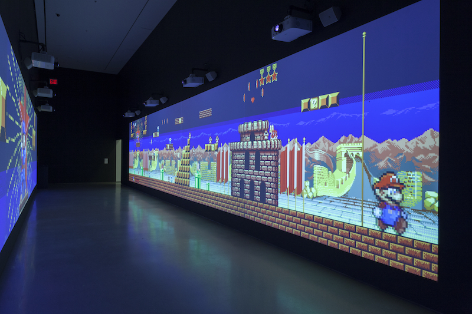
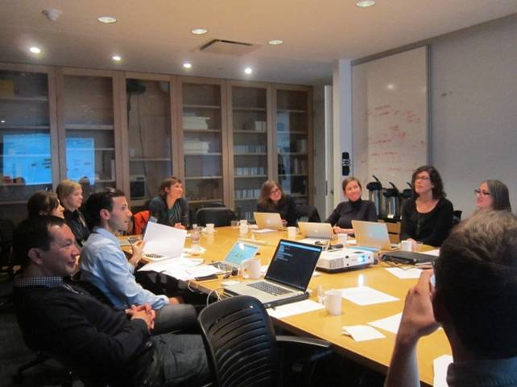
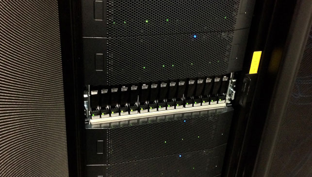

Since this project started in 2005, media arts have predominantly shifted to the digital realm. Digital collections and legacy works that have been digitized require appropriate storage. These pages focus on the challenge of creating storage systems for our digital art collections and moving digital collections into these systems.

Feng Mengbo _Long March: Restart_ (2008). Video game (color, sound), custom computer software, and wireless game controller. Dimensions and duration variable. The Museum of Modern Art, New York. Given anonymously, 2008. © 2015 Feng Mengbo. Installation view, Scenes for a New Heritage: Contemporary Art From the Collection, The Museum of Modern Art, New York (March 7, 2015 - April 10, 2016). Digital image © 2015 The Museum of Modern Art, New York. Photo: Thomas Griesel.

 
Our aim is to provide information that is useful to anyone who is caring for their own collection of video artworks in small, medium or large organizations as well as outside of an institution. Core principles are accentuated and you will find different approaches for different collection requirements highlighted throughout the text as quotes. We invite you to fill out a [survey]({{ site.url }}/sustaining-your-collection.html#Know-Your-Collection), which will act as a tool to help you outline the needs of your collection. The results will form the basis for an overall preservation system design.

 

<section id="Core-Principles" class="section scrollspy" markdown="1">

  

      Core Principles
      
     

      <ul>
       <li> Do to digital works as you would to any artwork: identify, catalog, describe, treat, document and track </li>
       <li> Be prepared to be unprepared: the necessary skills evolve constantly and will be found both within and beyond your walls </li>
       <li> Build storage for your present collection but lay groundwork for the future </li>
       <li> The budget to build collection storage is nothing without the budget to sustain it</li>  
       <li>Digital collections require active maintenance and will not survive passive storage</li>
     </ul>
     

</section>

<section id="Know-Your-Collection" class="section scrollspy" markdown="1">

## Know your Collection

The first step to planning what you need is understanding what you have. And how it might grow. This will form the basis to any further decisions regarding your infrastructure, staffing needs and budget. To help you with this initial assessment, we created a survey to gather all the core information.

<a href="{{ site.url }}/downloads/Survey_Scoping-your-collection.pdf">
  

    

      Survey: Scoping Your Digital Collection
      
This survey has been designed to help you to establish an overview of your digital collection. Although these pages only address the needs of digital video, the presence of other types of digital artwork or digital components will have an impact on decisions regarding your systems, for example the needs for storage.

    
 <!-- end of card-content -->
    

    <a href="{{ site.url }}/downloads/Survey_Scoping-your-collection.pdf">
      
<i class="large material-icons">play_for_work</i>Collection Survey
        

        </a>
        

          
  
 <!-- end of card -->

  
In order to plan for the storage and management of your collection, it is useful to define the categories of collection items and associated documentation that you hold. This might include the following:

<ul class="collapsible" data-collapsible="accordion">
<li>
  
Masters

  

Master material as provided by the artist, gallery, or donor. This may be a digital file, tape, film reel, disc or other.

</li>
<li>
  
Preservation Masters

  

Clones or derivatives of the artist’s master material made by your institution or a gallery for preservation purposes. This includes master files made through tape to file transfers.

</li>
<li>
  
Exhibition and Research Copies

  

Derivatives of the master material created either by the artist or by your institution for access, exhibition or loan.

</li>
<li>
  
Ancillary Material

  

Documentation created or received relating to the creation process and intended display of the artwork. This can include the artist’s installation instructions and exhibition documentation.

</li>
</ul>
 

You will then need to decide what level of preservation is needed for each category and how the various objects need to be linked to each other. Depending on your needs, you may want to keep all of this information together in one place, or you may wish to keep it in different locations or systems which are interconnected.

<h2 class="title">  Simple  </h2>
<h2>  ______________________  </h2>
“I focus on keeping master materials of my work on the hard drives I call my “archive.” I don’t have an organized way to keep the derivative files I’ve made for various other uses. Sometimes they don’t make it into the archive, but I figure I can make any format, if I have the master.”
<h2>  ______________________  </h2>

<h2 class="title"> Medium  </h2>
<h2> ______________________  </h2>
“We generally receive whatever the artist delivers us, though we have been making more of an effort to get master material. The bulk of the digital collection is H.264 .mov files for screening as well as ProRes or Uncompressed masters when we are able to receive them from the artist or gallery. In addition, we have been actively migrating our analog tape material to digital master files.”
<h2> ______________________  </h2>

<h2 class="title">  Complex </h2>
<h2>  ______________________ </h2>
“We keep every file we receive from the artist. When we create derivatives for preservation purposes, exhibition, or loan, every new file is given a component number in our collection management system and stored in the repository, along with details about the creation of those files. We make an access copy that goes into our DAM, so that our staff can view the collection without needing direct access to the digital repository.”
<h2>  ______________________ </h2>

</section>

<section id="Assess-Your-Skills" class="section scrollspy" markdown="1">

## Assess your Skills

Expert meeting of media conservators and archivists on digital repositories and user needs hosted by the Museum of Modern Art, New York. Digital image © 2014 The Museum of Modern Art, New York.

Caring for digital files is not fundamentally different from caring for art objects in other media, and the steps needed have parallels to the ones in more traditional conservation specializations.

For example, if a collection acquires a painting it will likely collect information about its creation, history, and condition, define and maintain the best conditions to store it, and ensure that handling and exhibition are appropriately managed. Museums and other institutions have become very good at ensuring that all these things happen to an agreed standard, and have highly developed teams dedicated to that end. It is just as relevant to understand what a digital file is, how it was created, its history and condition, and ensure that storage and display are appropriately managed.

If you are taking care of your own work or if you are in a small organization, relationships with external providers may be a key way of accessing those who have the necessary skills.

To enhance or acquire the skills needed to care for your collection, consider the following:

<ul class="collapsible" data-collapsible="accordion">
<li>
  
Collaboration

  

Not everyone will be able to acquire _all_ of the necessary skills, so collaboration is crucial to the successful care of your digital collection. This includes working with external specialists and facilities in the required fields, for example in video migration, but also connecting across an institution, or even sharing resources among institutions with similar requirements.

</li>

<li>
  
Conferences and Workshops

  

Attending related conferences is a good way to keep abreast of developments, and can also be used to help existing members of staff develop the skills needed. A more targeted way of developing those skills can be to attend or organize workshops about a specific subject.

</li>

<li>
  
Professional Networks

  

Participation in professional networks and leveraging community resources can be a very helpful way to exchanging one's experience and connecting with colleagues who are facing similar challenges.

</li>

<li>
  
Hiring New Staff

  

Depending on the size of your collection it may be necessary to create new roles or hire new staff to ensure the expertise is created and shared.

</li>
</ul>

<h2 class="title"></h2>
>“I have the skills to do the cataloging and copying files for back-ups. I can do some tape transfers using my own decks. For some transfers I go to specialists, if the original material has a condition issue or I don’t have the deck. I work with a professional editor for transcoding or remastering digital video, because I don’t understand all the variables well enough to get the quality result that I want. You can spend a lot of time and not get the results you want, or you’ll find out after the fact that it would have been better if you’d done it a different way.”

<h2 class="title"></h2>

“We have a full time manager of the collection who oversees all aspects of the acquisition, lending and general care of the art material. In addition, we have a support staff of part-time employees who specialize in cataloguing, art handling and general care/maintenance of the collection. As we have acquire more digital material, we have hired consultants to get us up to speed and adapt our collection management software to accommodate this material and set us up with the cloud storage and workflow for backing everything up.”

<h2 class="title"></h2>
“We have a full-time Media Conservator, Assistant Media Conservator, and a Digital Repository Manager, supported by our IT department. Our AV department handles the installation and maintenance of display equipment. We also have several staff members dedicated to the management of TMS, our collection management database.”

</section>

<section id="Calculate-Your-Budget" class="section scrollspy" markdown="1">

## Calculate your Budget

No matter if you are a private collector or a large institution, significant costs are involved in collecting and maintaining digital artworks. When calculating a budget, there are two different types of costs to consider: capital costs (one-time purchases of fundamental infrastructure or tools that will in theory last several years) and ongoing or recurring costs that will become part of a regular operating budget and may increase as your collection grows.

Drawing from the results of the [survey]({{ site.url }}/sustaining-your-collection.html#Know-Your-Collection), you can start to develop how much storage you will need and begin costing for digital storage, infrastructure and support. This can range from budgeting for hard drives to developing costs for a robust repository supported by IT staff. Below are 3 examples of different budgets and the necessary considerations to develop these budgets.

<h2 class="title"></h2>
>“We have a dedicated budget for staff and collections care for digital collections, as well as a budget for building and maintaining our storage infrastructure. Budgets are revisited annually as our growth estimates evolve.”

<h2 class="title"></h2>
>“We do have a budget primarily for storage and modest conservation assessments and costs. This budget was originally designed around physical storage for objects, but we have since expanded it to include budgeting for digital storage. We have a running storage cost for cloud storage [insert Amazon cloud costs here] and back up everything else to LTO tapes.”

<h2 class="title"></h2>
>“What budget? I have zero budget, so everything I invest in cataloging and storage feels like a stretch. But I do realize I have to keep track of my work and pay attention to storage, or else I risk losing my work. It’s hard to allocate money to save back-ups of my work when it’s not like it’s earning tons of money, but by keeping things simple I think I’ve been able to cover the basics at a reasonable cost.”

In order to be able to establish a budget you will need to have gathered the following:

<ul class="collapsible" data-collapsible="accordion">
<li>
  
Information about your Collection

  

    <ul>
      <li>What formats are present in your collection?</li>
      <li>How much material will you need to store?</li>
      <li>What is the total size of the files, if the material is stored as digital files?</li>
      <li>What is the duration of the material, if it is on tape?</li>
      <li>In what timeframe are you planning on migrating your tapes to file?</li>
      <li>How fast is your collection growing?</li>
       
    </ul>
  

</li>
<li>
  
Influencing Decisions

  

    <ul>
      <li> Will you keep all the copies of an artwork (i.e. artist supplied masters, archival masters, retired masters, exhibition copies, access copies)?</li>
      <li> Will you keep each component stored on its own with its own metadata or will you keep all the artwork's components together?</li>
      <li> What type of metadata and documentation will you keep with your components and what will be kept elsewhere?</li>
       
        </ul>
         </li>
    </ul>  
  

</li>
<li>
  
People and Facilities

  

    <ul>
      <li>Will you be working with external facilities and contractors? 
      Will you hire new staff?</li>
       
    </ul>
  

</li>
    <li>
    
Consumables

    
  
      <ul>
        <li>Details about the cost of any consumables</li>
         
      </ul>
    

   </li>
   <li>
    
Processing & Implementation Times

    

      <ul>
        <li> Information about how long processes will take of someone’s hands-on time (some processes might take many hours of computer time to process but they only need to be monitored occasionally). These processes may include:</li>
         

        <li>- Initial assessment of material</li>
        <li>- Cataloguing and documentation</li>
        <li>- Migration from analog to digital</li>
        <li>- Preparing your files for ingest or transfer to storage</li>
        <li>- Ingest or transfer to storage</li>
 
        <li>It is also important to estimate a timeframe for implementation. It can be helpful to determine how long it will take to complete the process from start to finish for a single item and extrapolate from there.</li>
 
        <li>If you want your budget to link to planning you might also want to know how long it will take to complete the process from start to finish for a single item.</li>
         
       </li>
      </ul>
    

  </li>
</ul>

<!--
[Link to the budget template](https://docs.google.com/spreadsheets/d/1WBgSIlsFzoQEWQQaz-cIWYo5LjTrvcYtuWyd9¬HnG8g/edit?usp=sharing) -->

### Estimate your storage costs

For each storage option, and depending on the size of your collection, you may need to consider:

* The __initial cost__ to set up your digital storage

* The __ongoing cost__ of sustaining your digital storage - depending on the option you choose this may include annual maintenance fees as well as incremental expansion costs

* The __staff and vendor time__ involved to establish and maintain the system

A budget can be set annually or in relation to specific projects. A budget needs to be monitored so that it can be adjusted if you find your assumptions are inaccurate; for example things may be taking longer than expected, or costs change.

</section>

<section id="Review-Collection-Management-Systems" class="section scrollspy" markdown="1">

## Review Collection Management Systems

The collection management system is typically a database containing basic information about each artwork. It enables collection managers to perform the following essential functions:
 

* Maintain an inventory of all collection items

* Record acquisition details, including information about the artist, any donor or purchase information and any key provenance information

* Keep a history of exhibitions or displays, including loans

* Track the location of physical and digital parts of collections items, including the ability to track versions of digital files as they get transcoded or migrated

* Record condition information  and technical information about an artwork to inform its ongoing management

<h2 class="title"></h2>
>“I used to use a spreadsheet, but it got unwieldy with too many objects. It’s also designed for calculations and data manipulation, not keeping discrete object records. I now have a database that can accommodate much more information, and is much easier to navigate and search.”

<h2 class="title"></h2>
>“We use a free, web-based open source database that’s designed for museums. It allows us to assign everything a unique identifier which is connected to the main artwork. We can add acquisition, loan, and location information to the main record, and even use barcodes to track movement of physical collection objects.”

<h2 class="title"></h2>
>“We are a museum using TMS. We create an object record for the work and then create separate components for each physical or digital object that is part of that work. It enables us to record attributes, relationships, and contextual information, effectively centralizing the essential information about complex works with many elements.”

Depending on your context and the size of your collection, a collection management system will look very differently. For a small institution or individual collector, collection management functionality could be carried out using a database or spreadsheets, templates and standardized metadata. For a larger institution, a managed database will be necessary in order to:

* provide a central information point with a consistent level of information about an entire collection regardless of medium or type

* facilitate certain core workflows (for example an acquisition process or loans process)

* provide auditing and reporting functions

* allow for access to information and the ability to edit information to be defined at a user level  

* allow for multiple users to update information and keep it current

The larger the number of users and objects and the more complex the workflows the more necessary a specialized database, ie. a collection management system, will become. Software to maintain an inventory could range from an Excel spreadsheet, a database like Filemaker, an open source collection management software such as <a href="http://www.collectiveaccess.org/about">CollectiveAccess</a> or <a href="http://omeka.org/about/">Omeka</a> to the type of collection management system employed by museums, for example <a href="www.gallerysystems.com/products-and-services/tms/">The Museum System (TMS)</a>, Mimsy or a bespoke system developed by your institution.

It is uncommon to find one system that will facilitate both the collections management activities outlined above, and also digital preservation. Therefore it is often the case that different systems and tools are used for serving these two different core needs – for instance the use of a digital asset management system or a digital repository in addition to a collection management system. Before building or implementing any specialized systems beyond a collection management system, however, it is important to consider how this specialized system will integrate and communicate with your existing collection management system.

In a completely manual environment, you would be able to incorporate any additional information needed for the digital repository functions (for example checksum monitoring, format registry etc) and your core collection management information (for example location tracking) into one database. For larger digital collections there are significant gains to be made in terms of time and accuracy in taking advantage of tools that automate certain functions within the workflow. This often creates information about your digital artworks which you will wish to record and maintain. Where specialist (often proprietary) databases exist, integration with any repository software or digital asset management systems can be a challenging, expensive and skilled operation.

### Organizing your collection's information

In most cases the information about an art collection will be formed of a rich cluster of records that have been compiled and edited over time. Often only a fraction of this information is held within a central database. Many institutions will also have records management systems for this associated documentation.

The challenge here is to ensure that when you pull a digital object from storage after many years, you will have the information you need to understand what the materials are, how they can be viewed properly, their purpose in relation to the artwork to which they belong, and finally the ability to validate and prove their authenticity.

There is a certain amount of information you should make sure is held with the files, so that even if other information is lost, you still know what artwork it is and that the file itself has not changed.

<ul class="collapsible" data-collapsible="accordion">
<li>
  
Core descriptive information

  

    <ul>
      <li>Artwork title and artist's name. If you have a collection management system the descriptive information should also include an identifier to that artwork’s record. These identifiers must be persistent, meaning they are permanent and will never change.</li>
    </ul>
  

</li>
<li>
  
Fixity

  

    <ul>
      <li>
       Creating checksums allows you to ensure that a file has remained unchanged. For more information, please refer to the <a href="http://mattersinmediaart.org/sustaining-your-collection.html#Implement-Fixity">Fixity</a> section</li>
    </ul>  
  

</li>
<li>
  
Technical Information

  

    <ul>
      <li>Each digital file has technical information embedded in its header or wrapper. If you have a large collection, consider extracting this information and storing it within your collections management system, so that you can search across your collection.</li>
    </ul>
  

</li>
</ul>

There is further information that will need to be kept in order to ensure an artwork can be preserved and displayed in the future. This can be either kept with the file or in other systems, like a database or collection management system.

<h2 class="title"></h2>
>“We prefer to have all the information about an artwork together, so we keep any files, display specifications, certificates and promotional documents within a folder structure in storage.”

<h2 class="title"></h2>
>“We need to keep track of individual files, in our storage but also in our collection management system (TMS) and see specific information for each individual file. The most flexible and easiest way to do this within our systems is to give each component a unique identifier that connects directly to the artwork record in TMS, as well as conservation documentation.”

### Digital Repositories

Collections management systems however are just a part of the picture of digital stewardship, as they do not generally facilitate core digital preservation actvities. To meet these needs, organizations typically employ a system, or suite of systems referred to as a digital repository. There are many functions that can be carried out by a digital repository system in order to monitor and ensure the ongoing preservation of your collection objects. Just as for collection management systems, the way these functions are implemented will depend on individual circumstances. For a small, homogenous collection, many of these functions could be carried out manually. For a larger and more varied collection, there are significant benefits to having automated workflows and systems in place.

This is an area which has developed very rapidly in recent years and even large organizations have struggled to develop the infrastructure to keep pace with their growing digital collections. It is therefore important to understand that the term repository refers to a number of functions which need to be carried out and which are underpinned by some of the key ideas to emerge regarding digital preservation practice.

These functions can include:

* Automated workflows for the ingest of digital objects, including the extraction of metadata and packaging of the object and metadata for storage

* Generation of a persistent identifier for each digital object and a permanent relationship to associated metadata

* Generation of normalized masters where necessary. A normalized master is a preservation copy of a file in a standardized format. There is some debate regarding when the creation of normalized copies is advisable. In general, video file formats are less vulnerable to obsolescence than tape formats. This is partly because it is easier to support software playback over time, especially given open source tools such as ffmpeg.

* Generation of access derivatives and an interface for user access to these derivatives, alongside associated metadata

* Auditing of system and user activities

* Active monitoring of file integrity

* Recording and reporting on collection characteristics, such as file formats

* Monitoring of preservation risks, e.g. file obsolescence and software dependencies

</section>

<section id="Design-Your-Storage" class="section scrollspy" markdown="1">
## Design your Storage

This section outlines the key elements associated with the design and build of reliable storage for long term digital preservation. The content has been arranged to address a range of situations; whether you are an individual who is designing a low risk personal storage solution, through to a large organization. No matter the size of your collection the following core principles need to be considered when designing your storage:

  

    

        Core Principles
        
       

       <ul>
        <li> Geographic Redundancy - Multiple copies of data should be held at different geographical locations, and a disaster recovery plan should be in place. </li>
        <li> Fixity Checking - Regularly monitoring digital files in order to detect corruption or unwanted changes to your data. </li>
        <li> Access and Security - The speed and restriction of access to data needs to be appropriate for its intended use and the level of protection required. </li>
        <li> Technology Monitoring - Trends in storage technology should be monitored to assess when migration to new storage media will be necessary.</li>  
      </ul>
       

    

  

When scoping your current storage infrastructure for the purposes of digital preservation, it is helpful to understand the difference between standard storage setups and those suitable for digital preservation. Standard storage systems are designed for digital objects that are in active use and while backup procedures are usually included, they generally do not meet the more stringent requirements to ensure long term preservation of data. For example, within a normal institutional information technology set up, it is standard practice for backup tapes to be wiped and re-used after a few months. Active use storage is also unlikely to have a system in place to identify that information has changed or been lost. When data is changing all the time, it is not possible to easily detect the difference between intended and accidental changes. In contrast, preservation storage systems require the active monitoring of data in order to detect unwanted changes, such as corruption or damage. Their high level of redundancy with copies in several locations enables the data to be restored should a problem arise. Ideally, they will also have a disaster recovery plan.

### Redundancy
The lifetime of a hard-drive varies from three months to five years. If you only have one hard drive and it breaks down, data recovery is very costly, and can be catastrophic. As a rule of thumb: **One copy is no copy. Save three copies of your data on at least two mediums (e.g. hard drive, server, LTO tape, flash drive, cloud) and in at least two geographic locations.**

There are several reasons for maintaining duplicate copies of files, such as ensuring high availability and the ability to recover from a disaster situation or accidental modification or deletion. The type of storage you choose for copies of your data will depend on how quickly you will need to access the data should you lose the primary copy. If speed is important, this will normally require an exact duplicate of the primary infrastructure at an off site location, with an equivalent connection to the outside world or access points. This infrastructure would contain a complete and up to date copy of your entire collection.

When maintaining a copy of data for disaster recovery purposes (for instance, in the event of fire, flood, or earthquake), the goal is simply to be able to retrieve, rebuild, and access your data. Within reason, ease of access is not a priority. An LTO tape stored off-site is one example of a suitable medium for a disaster recovery backup.
There are many storage options that will support geographic redundancy. The right option for you will depend on your budget and the size of your collection.

Hardware: potential options (2016)

* 0 to 5TB in the next 5 years and small budget -RAID 1
* 5TB to 25TB - RAID-5 or 6 or 7
* 25TB and higher - some kind of enterprise storage - OR - multiple RAID 5 or 6 or 7 that support daisy chaining

Keeping multiple copies in sync: potential options

* Manual 
* Peer-to-peer file sharing (P2P)
* Cloud service (i.e. dropbox, crashplan, http://www.cloudwards.net...)

<h2 class="title"></h2>

“I want to keep this as simple as possible so to achieve my 3 copies and multiple geographical locations, I purchased three RAID 1 drives. One for my studio, one for my home, and one for my friend’s home. To keep my three RAID 1 drives in synchronization I manually sync my studio drive with my home drive on a weekly basis, and then manually sync with my friend’s drive twice a year.”

<h2 class="title"></h2>
“I have about 10TB of data, which I do not access that frequently and have the funds to pay an annual fee to storage my data in the cloud.”
“We have about 10TB of data, and expect to only have 15TB in five years, so we have two 18TB RAID devices that plug right into my Mac at  home and the office. I pay an annual fee for a cloud backup service, which we can use to keep our two locations in synchronization, as well as having the benefit of the third copy in the cloud.”

<h2 class="title"></h2>
 “I manage a collection that currently has 35TB. Based on acquisition analysis I estimate that over the course of the next five years, we will grow to around 50TB. In consultation with our IT department, I found out that they actually already have some storage infrastructure at two locations, both of which can scale to this size. They added the amount of storage that we needed for this year’s growth, and have budgeted for the anticipated growth over the next five years. I conveyed to IT that these digital artworks are very valuable, and so they have set carefully considered read/write access permissions that are more restrictive than the policies set for other kinds of data managed on this system. Ideally we should have three copies in three locations, but unfortunately the budget can not accommodate cloud storage, or building a third data center, so as an alternative I currently manually back the data up to LTO tapes which we store in a third location in the event that we need to recover from a disaster.”

A duplicate copy of your data may be maintained for high availability, disaster recovery, or recovery from accidental modification or deletion (or a combination of these purposes).

High-availability: This is a redundant copy of your data maintained for the ability to provide easy access to the data with no downtime in the event of loss of the primary copy. Typically this means an exact duplicate of the primary infrastructure at an off site location, with an equivalent connection to the outside world or access points. This infrastructure would contain a complete and up to date copy of your entire collection. With high-availability copies of data, ease of access is paramount.

Disaster recovery: When maintaining a copy of data for disaster (for instance, in the event of fire, flood, or earthquake) recovery purposes, the goal is simply to be able to retrieve, rebuild, and access your data. Within reason, ease of access is not a priority. An LTO tape stored off-site is one example of a suitable medium for a disaster recovery backup.
</section>

<section id="Implement-Fixity" class="section scrollspy" markdown="1">

## Implement Fixity

When creating a secure storage environment for your data, you will want to make sure the data itself stays safe and does not change without your knowledge. This process is known as fixity. In digital preservation, this is achieved by generating checksums for your files which are monitored by re-checking, on a regular basis.

Simply put, your file is run through a certain algorithm (the most commonly used algorithms are MD5 and SHA) that produces a unique alphanumeric sequence. The slightest change to your file will produce a completely different checksum. With this simple process, it is possible to identify any changes to your files. The types of changes which can be identified with this method are those which indicate corruption, loss of data, or unintended manipulation. If you have an automatic monitoring system in place, it would alert you if such a change occurs.

Calculate checksums as soon as you’ve received or created a file. This could mean creating checksums as you export a file from the hard drive on which an artwork was received, or as soon as you have exported a file from an editing program or after digitizing a tape.

RAID and enterprise storage systems provide what could be considered a basic form of fixity. Data in these systems are monitored for integrity at the block-level – meaning the smaller blocks of data that a file is composed of. If one hard drive fails, the system can restore the lost data by using the redundant data block and the checksum. This, however, only detects data corruption that occurs as the fault of the storage device itself – it would not be aware of the accidental corruption, modification, or deletion of a file as enacted by a user or piece of software. In digital preservation we use checksums at the file-level in addition to block-level checks.

A checksum enhances these block-level checks insofar as it is a portable piece of evidence that can travel with a file, and be checked, regardless of storage the type of storage system it resides on –  it can prove that a file has not been modified since chain of custody was established.

### Checksum Tools

These tools can simply generate checksums – out of the box, they will not necessarily store the checksum value, or facilitate the verification of a checksum.

* <a href="https://en.wikipedia.org/wiki/Md5sum">md5</a> - This can be run via Terminal on Mac or Linux.

* <a href="https://en.wikipedia.org/wiki/Sha1sum">shasum</a> - This can be run on Mac, Linux and Windows.

* FCIV (File Checksum Integrity Verifier) – windows command line tool for generating MD5 or SHA1 checksums.

These tools create checksums, store the values, and facilitate the verification of checksums after the fact.

* <a href="https://support.apple.com/en-us/HT201259">Checksum+ (OS X)</a> -  With this tool you can just select a file and it will create a checksum for you, stored within an .md5 file, in the same location, with the same name as your file. Double-clicking this .md5 file will run a fixity check and tell you, if everything’s ok. If you open it with a text editor, it will show you the MD5 checksum as well as the file it is pointing to. It is important that both the .md5 and the original file are stored in the same folder.

* <a href="http://www.fastsum.com/">Fastsum</a> - for windows.

* <a href="https://en.wikipedia.org/wiki/BagIt">BagIt</a> - Developed by the Library of Congress, this tool is used in a command line interface. BagIt was originally created to safely transfer files from one place to another, by packaging the original data in a 'bag' (folder) and creating checksums for each file within that bag. It also stores information about the date and software version as text files within the bag and creates checksums of all these text files, including the checksum files themselves. Find a series of tutorial videos <a href="https://www.youtube.com/playlist?list=PL1763D432BE25663D">here</a>.

* <a href="https://www.avpreserve.com/tools/fixity/">Fixity</a> - AVPreserve has created a tool hat enables the user to identify seven directories that the program can check automatically on a monthly, weekly or daily basis.

* <a href="https://www.archivematica.org/">Archivematica</a> - comes with a command-line based tool for running fixity checks.

* <a href="https://www.nagios.com/products/nagios-core/ ">Nagios</a> - The open source industry standard in IT infrastructure monitoring and alerting. <a href="http://bit.ly/1p5KDGO">Various checksum plugins<a/> are available.

* For more possible checksum tools <a href="http://coptr.digipres.org/Category:Fixity">click here</a>

<h2 class="title"></h2>
“I generate checksums using BagIt at the point of acquisition to ensure safe transport to my centralized storage device. Once the materials enter our repository, AVPreserve’s “Fixity” tool is implemented. It’s incredibly useful because it runs in the background, and not only alerts us to modified files, but also deleted, moved, renamed and new files since the previous check.”

<h2 class="title"></h2>
“I immediately use BagIt to transfer my files onto the server from the acquired hard drive into a bag and put a schedule in place where I verify the checksums monthly. Since I have my files in 3 locations, I run the ‘bag verifyvalid’ command on all of the bags in all three locations. I used to do this manually, but my IT department wrote a very simple bash script that runs the ‘bag verifyvalid’ command against any and all bags in the location supplied to the bash script.”

<h2 class="title"></h2>
“I don’t manually create or check any checksums, but I researched it thoroughly and found that the cloud service that I use for syncing between my three locations does in fact checksum files, and retain infinite version history. So if I ever found that I couldn’t open a file because it became corrupt, or was accidentally deleted, in theory, I could revert back to the last known good state. The only downside to this is that it doesn’t automatically notify me if something is deleted, modified, or corrupted, because it doesn’t know the difference between accidental and intentional modification.”

<h2 class="title"></h2>
“We use an on-premises but remotely managed digital preservation software as service (SaaS) solution. We generate checksums using BagIt at the point of acquisition, but once materials enter our repository, fixity is monitored and managed by our service provider.”

<h2 class="title"></h2>
“I partner with my IT department as they have to meet standards of something called PCI compliance which requires them to have software for monitoring file integrity for security purposes. They have software such as Nagios or Tripwire, which can be configured to schedule the monitoring of checksums and they handle the enterprise reliability of these systems in addition to sending me email alerts if anything has changed.”

</section>

<section id="Provide-Access" class="section scrollspy" markdown="1">
## Provide & Limit Access
When designing your storage, you will need to consider who should be able to access it and how. It is best practice to limit access to your master material, both to prevent unwanted changes being introduced and for legal and copyright reasons.  It may also be necessary to record each time the system is accessed and by whom - this will be particularly relevant to collecting institutions with audit requirements.

Depending on who needs to access your collection, you may also wish to consider storing compressed derivatives of your master files in a more accessible location. This will not only be more practical than accessing large uncompressed masters, it will also reduce the risks involved with allowing access to your masters.

<h2 class="title"></h2>
“Different levels of permissions are set and maintained by our Digital Repository Manager and every time a digital collection object is downloaded, there is a record of who did so and why.”

<h2 class="title"></h2>
“Access is only open to the small staff of the collection. The RAID is internally networked and does not point “out”. There is some concern about the cloud storage system, but we’ve been told it’s fairly secure. The LTO tapes are stored within our general art storage facility, which maintains a fob and key system.”

<h2 class="title"></h2>
“My biggest concern is people using master material without permission. Once I provide high-quality materials for one purpose, they sometimes travel and reappear elsewhere without permission. In my studio it’s not an issue; access is pretty open.”

</section>

<section id="Keep-up-with-Technology" class="section scrollspy" markdown="1">
## Keep up with Technology
Storage technology changes rapidly, so it is important to keep up to date and informed. You should keep an eye on the long-term viability of your chosen storage system and be proactive in migrating to more sustainable storage media or services. You will need to consider the reliability and availability of the storage media itself as well as the equipment needed to access it.  

For example, if your storage system incorporates LTO tapes you will need to monitor any manufacturing issues for your brand of tape, updates to the LTO standard, and the availability and compatibility of LTO drives.

<h2 class="title"></h2>
“We are able to generate statistics on the file types in our repository and we can plan accordingly.”

<h2 class="title"></h2>
“I try to keep up with what are considered the best file formats to choose for long-term preservation of my master materials, using blogs and white papers put out by the digital preservation and conservation fields. However, I usually find out something is out-of-date when it stops working. I have had trouble with my back-up hard drives when I upgrade my computer or operating system, and then I have to use the old computer to move things onto new drives.”

<h2 class="title"></h2>
“We lean on the expertise of our consultants to tell us what we should be looking out for. We generally try to keep to digital preservation best practices of little to no compression, open formats, etc. In terms of systems, we again rely on our consultants, who we bring in at least once a year, to assess our storage and file needs and make recommendations for us.”

</section>
